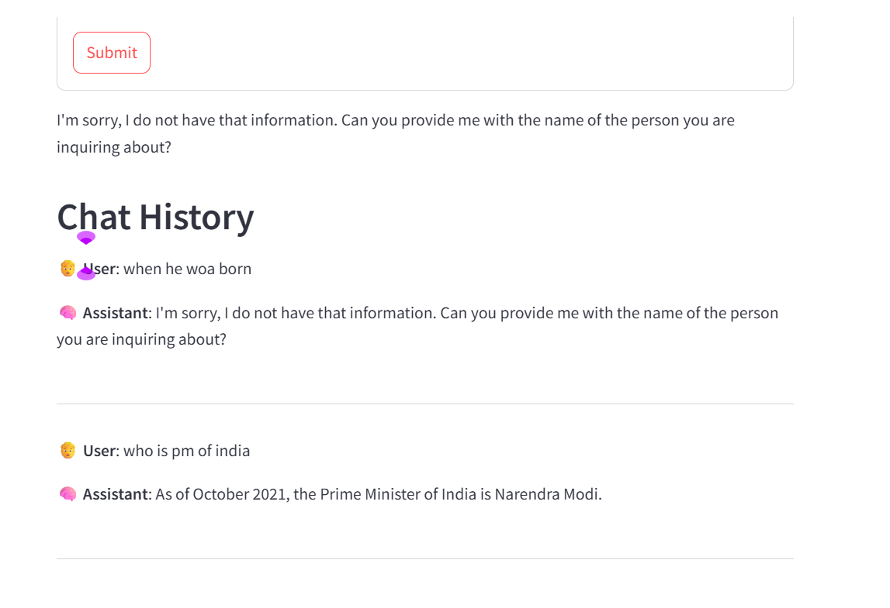

# 🤖 Offline Chatbot with LangChain, Ollama, and LLama 3.2

This project demonstrates how to build a fully **offline AI chatbot** using **LangChain**, **Ollama**, and **LLama 3.2**. The chatbot runs entirely on your local machine, ensuring **data privacy**, **low latency**, and full **control over the LLM stack**—without relying on internet access or external APIs.

---

## 🚀 Features

* **Fully Offline**: No internet or cloud API required—works even in air-gapped environments.
* **Privacy-Preserving**: All data stays local. No conversations are logged or shared.
* **Powered by LLama 3.2**: High-performance open-source language model from Meta.
* **LangChain Integration**: Modular, extensible architecture using LangChain components.
* **Customizable**: Add your own tools, retrievers, and prompts easily.

---
# Screan Short



---
## ✅ Advantages

| Advantage                 | Description                                                                |
| ------------------------- | -------------------------------------------------------------------------- |
| 🔐 **Offline Capability** | No dependency on OpenAI, Anthropic, or any external services.              |
| 🛡️ **No Data Leakage**   | All interactions and data are processed locally—ensuring maximum security. |
| 🚀 **Low Latency**        | Fast responses as there’s no network overhead.                             |
| 🧩 **Modular Design**     | Easily extend with custom tools, memory, or retrievers via LangChain.      |
| 🔄 **Repeatable Setup**   | Runs reliably across systems with reproducible environments.               |

---

## ⚠️ Disadvantages

| Disadvantage                   | Description                                                                  |
| ------------------------------ | ---------------------------------------------------------------------------- |
| 🖥️ **High Computation Needs** | Requires a system with a modern GPU and at least 8–16GB of VRAM.             |
| 🧠 **Model Size**              | LLama 3.2 is resource-intensive and may not run smoothly on low-end systems. |
| 🕐 **Longer Setup Time**       | Initial download and setup of model weights can be time-consuming.           |

---

## 🛠️ Tech Stack

* **LLM**: LLama 3.2 via [Ollama](https://ollama.com/)
* **Framework**: [LangChain](https://www.langchain.com/)
* **UI/UX**: Streamlit 
* **Local Execution**: No cloud or external API integration

---

## 📂 Project Structure

```
offline-chatbot/
│
├── app.py                # Main chatbot script (LangChain/Ollama interface)
├── requirements.txt      # Python dependencies
└── README.md             # Project overview
```

---

## 📦 Installation

1. **Install Ollama** and run:

   ```bash
   ollama run llama3
   ```

2. **Clone the repo**:

   ```bash
   git clonehttps://github.com/lakshmiprasadlp/Offline-Chatbot-with-Langchain-Ollama-LLAMA-3.2-.git
   cd Offline-Chatbot-with-Langchain-Ollama-LLAMA-3.2-
   ```

3. **Install dependencies**:

   ```bash
   pip install -r requirements.txt
   ```

4. **Run the chatbot**:

   ```bash
   python app.py
   ```

---

## 📌 Use Cases

* Private enterprise chatbots
* Secure legal/medical advisors
* Offline field assistants (e.g., defense, rural, or research environments)

---

## 📃 License

This project is open-sourced under the **MIT License**. Feel free to modify and adapt it for your use.

---

